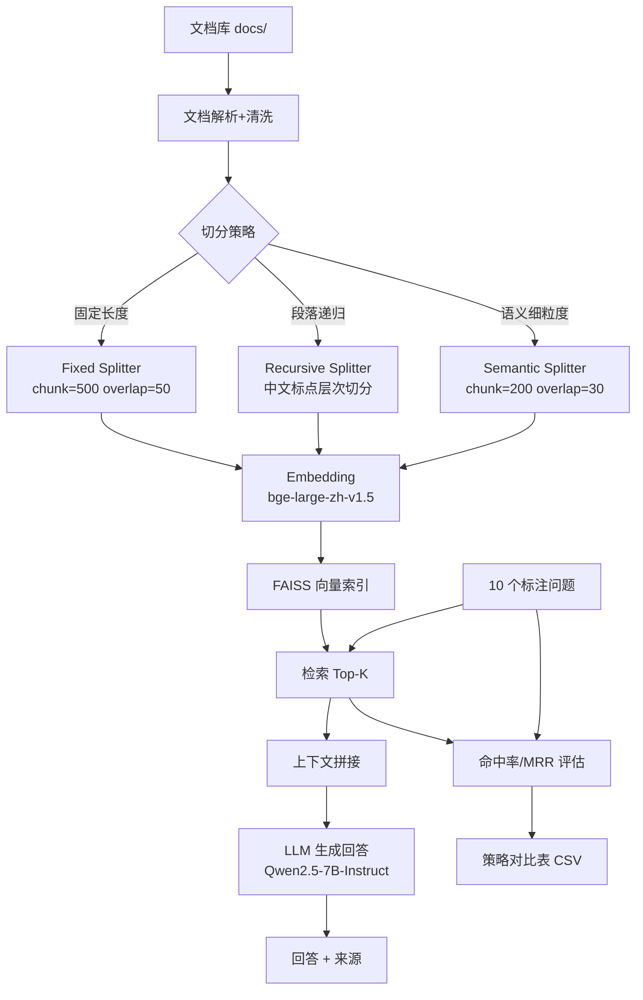

# 项目2：RAG 数据处理管道

> 构建 RAG（检索增强生成）数据处理管道，实现文档解析 → 文本清洗 → 多策略切分 → Embedding → FAISS 检索全链路，并对比 3 种切分策略的检索效果。

## 架构图



## 技术栈

| 组件 | 技术 | 说明 |
|---|---|---|
| 文档解析 | Python + regex | 支持 .md/.txt，清洗去空白统一换行 |
| 切分策略 | 自实现 3 种 | 固定长度 / 段落递归 / 语义细粒度 |
| Embedding | 硅基流动 API | BAAI/bge-large-zh-v1.5（1024 维） |
| 向量检索 | FAISS (IndexFlatIP) | 精确检索，cosine 相似度 |
| RAG 生成 | 硅基流动 API | Qwen2.5-7B-Instruct |
| Web 界面 | Gradio | 问答 Demo |
| 评估 | 自实现 | Top-K 命中率 + MRR + 检索延迟 |

## 快速开始

### 1. 安装依赖

```bash
pip install -r requirements.txt
```

### 2. 配置 API Key

```bash
cp .env.example .env
# 编辑 .env，填入硅基流动 API Key
```

### 3. 生成文档库

```bash
python scripts/generate_docs.py
# 生成 24 份 AI 技术文档到 docs/
```

### 4. 运行检索质量评估

```bash
python scripts/evaluate.py          # 真实 API
python scripts/evaluate.py --mock  # Mock 模式（无需 Key）
```

输出：3 策略对比表（命中率 / MRR / 延迟）+ CSV + JSON

### 5. 启动 RAG 问答 Demo

```bash
python app.py
# 打开 http://127.0.0.1:7860
```

## 项目结构

```
project2-rag-pipeline/
├── app/
│   ├── config.py              # 配置
│   ├── document_processor.py  # 文档解析+清洗
│   ├── chunker.py             # 3 种切分策略
│   ├── embedder.py            # 硅基流动 Embedding 客户端
│   ├── indexer.py             # FAISS 向量索引
│   └── rag_chain.py           # RAG 问答链
├── scripts/
│   ├── generate_docs.py       # 文档生成器（24 份 AI 技术文档）
│   └── evaluate.py            # 检索质量评估（命中率/MRR/延迟）
├── docs/                      # 文档库（24 份 .md）
├── results/                   # 评估结果输出
├── app.py                     # Gradio 界面
├── requirements.txt
├── .env.example
└── README.md
```

## 3 种切分策略说明

| 策略 | 参数 | 特点 | 适用场景 |
|---|---|---|---|
| **fixed** (固定长度) | chunk=500, overlap=50 | 按字符数等分+滑动窗口 | 格式统一的文档 |
| **recursive** (段落递归) | chunk=500, overlap=50 | 按中文标点层次切分，优先自然边界 | 技术文档（推荐） |
| **semantic** (语义细粒度) | chunk=200, overlap=30 | 小块细粒度 | FAQ 类文档 |

## 评估指标说明

### Top-K 命中率
正确答案文档出现在检索 Top-K 结果中的问题占比。Top-5 命中率 80% = 80% 的问题正确答案在前 5 个检索结果中。

### MRR (Mean Reciprocal Rank)
衡量正确答案的排名质量。每个问题的得分为 1/rank（第 1 位=1.0，第 2 位=0.5，第 5 位=0.2），取平均。MRR 越高说明正确答案排名越靠前。

### 检索延迟
单次检索的耗时（毫秒），包括查询 Embedding + FAISS 搜索。报告平均值和 P95。

## 面试必考题参考

### Q1: 3 种切分策略各有什么优劣？
- **固定长度**：简单可控，块大小一致，但可能切断语义。
- **段落递归**：优先在自然边界切分，语义完整性好，是最常用的策略。
- **语义细粒度**：检索精度高但上下文可能不足，适合 FAQ。

### Q2: 为什么选 bge-large-zh-v1.5？
- 中文效果优秀（C-MTEB 基准排名前列）
- 1024 维，存储和检索效率好
- 硅基流动免费提供 API，无需本地部署

### Q3: 命中率和 MRR 有什么区别？
- 命中率只看正确答案是否在 Top-K 中（二元判断）
- MRR 还看排名位置（第 1 位和第 5 位得分不同）
- 两个系统可能命中率相同但 MRR 不同

### Q4: FAISS vs Milvus？
- FAISS 是库，单机百万级，无分布式
- Milvus 是数据库，支持分布式、十亿级、高可用
- 项目级用 FAISS 足够，生产级用 Milvus

### Q5: 100 万文档怎么扩？
- 用 IVF 或 HNSW 索引替代 Flat
- 分片部署多 FAISS 实例
- 或直接迁移到 Milvus 分布式

## 真实指标（实测后填入）

| 策略 | 块数 | 均长 | Top-5 命中率 | MRR | 均延迟 | P95 延迟 |
|---|---|---|---|---|---|---|
| fixed | ___ | ___ | ___ % | ___ | ___ ms | ___ ms |
| recursive | ___ | ___ | ___ % | ___ | ___ ms | ___ ms |
| semantic | ___ | ___ | ___ % | ___ | ___ ms | ___ ms |

> 最优策略：___（依据：命中率/MRR 最高且延迟可接受）
